### Step 1

I started the Jenkins container using this command:

```bash
docker run -d -v /var/run/docker.sock:/var/run/docker.sock -v $(which docker):$(which docker) -p 8081:8080 -p 50000:50000 jenkins/jenkins:lts;
```

To get the initial admin password, I checked the logs:

```bash
docker logs 6912
```

then i copy e7a783f95e8f448fa87857ec66c40506 and put it at administrative pswrd
then I slected Install suggested plugins

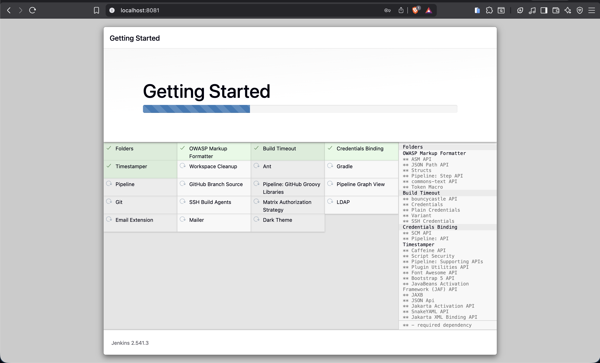
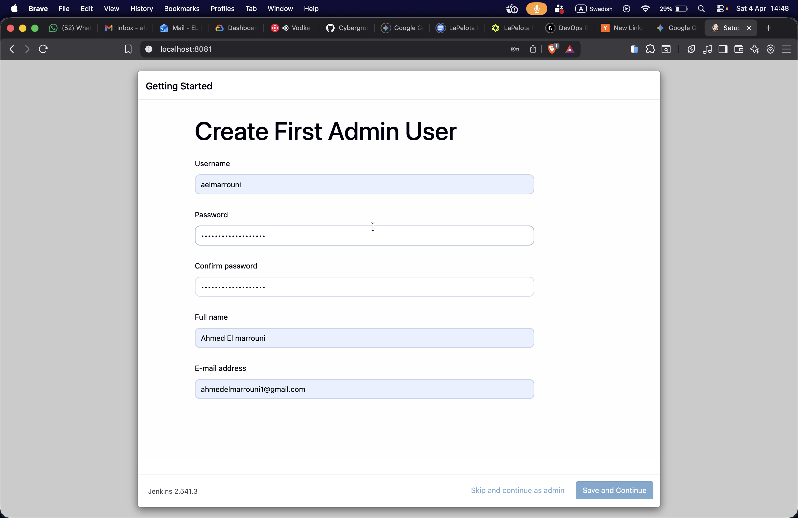
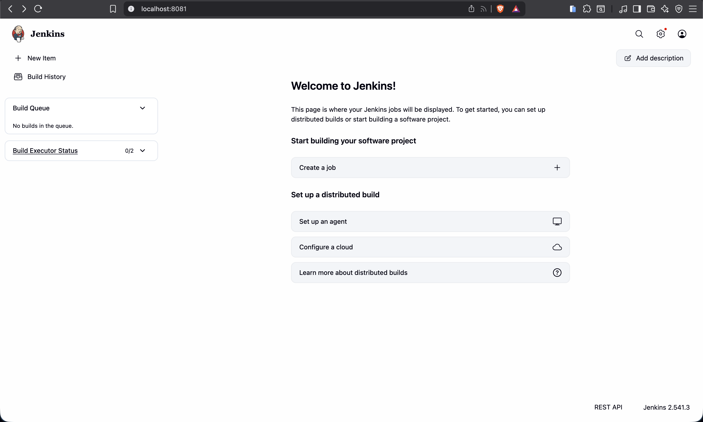

AT maven I instakked the latest version
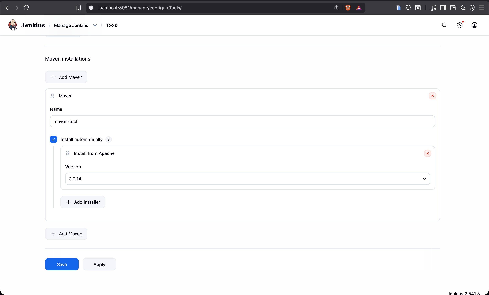

Then, I copied the password (e7a783f95e8f448fa87857ec66c40506) and put it in the administrative password field. After that, I selected "Install suggested plugins".

For Maven, I installed the latest version.

(Note: If you use the docker-compose setup instead, you can get the initial admin password like this:)

```bash
docker exec first-lab-jenkins-1 cat /var/jenkins_home/secrets/initialAdminPassword
```

Alternatively, u can find it in the container logs by running:

```bash
docker logs first-lab-jenkins-1
```

### step 2

Next, I needed to make my local Jenkins available online. I installed ngrok:

```bash

brew install ngrok/ngrok/ngrok
```

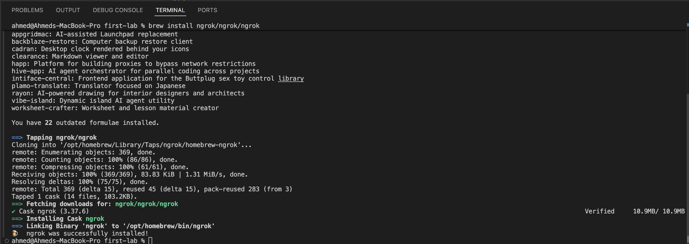

Then, I made the tunnel point to my Jenkins port (8081):

```bash
ngrok http 8081
```

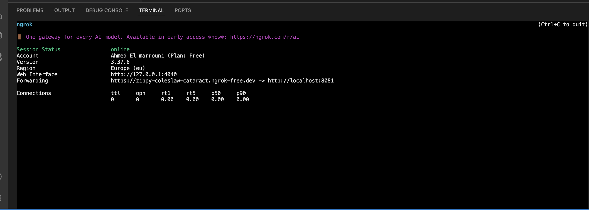

### Step 3: Add Webhook to GitHub

After I got the ngrok link, I added a webhook to my repository on GitHub so it can talk to Jenkins.

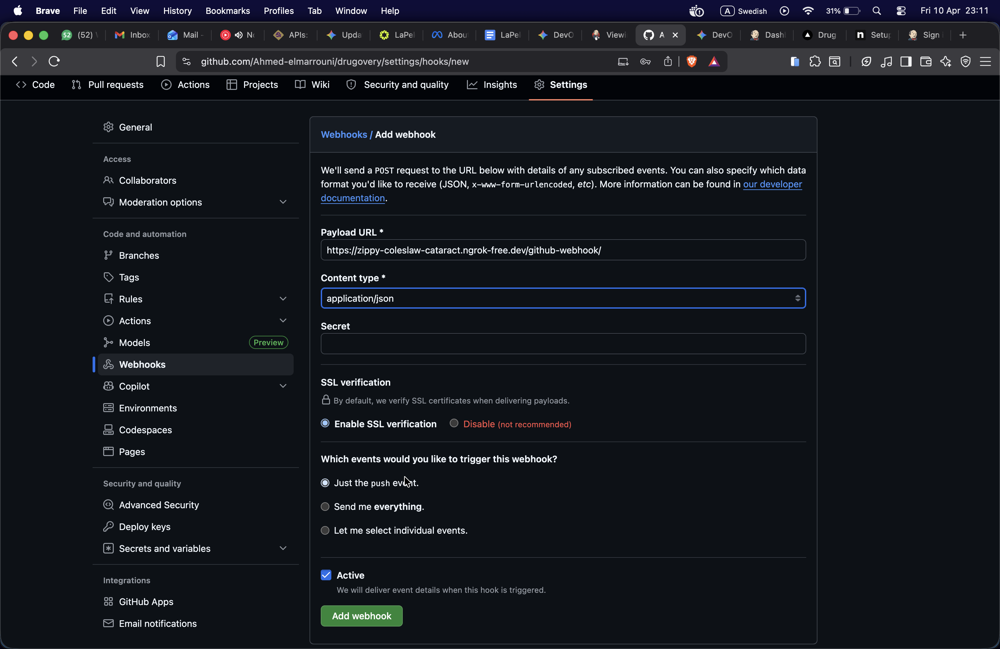

### Step 4

I created the new Pipeline in Jenkins.
I made sure to check "GitHub hook trigger for GITScm polling" because this is what connects Jenkins to the ngrok webhook.


I checked GitHub hook trigger for GITScm polling because
It connects Jenkins to the ngrok webhook
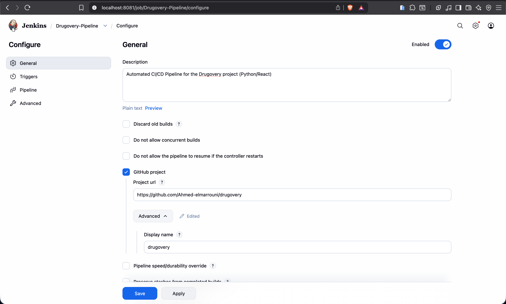
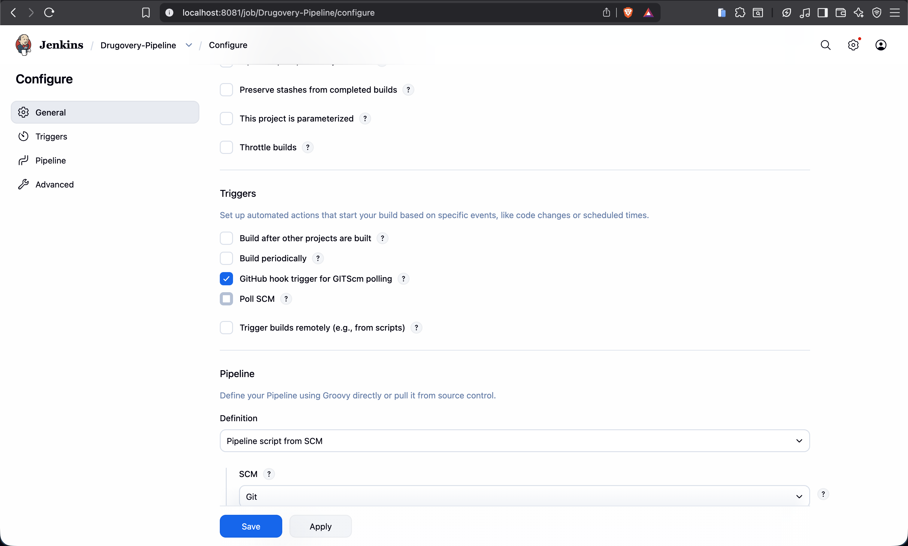
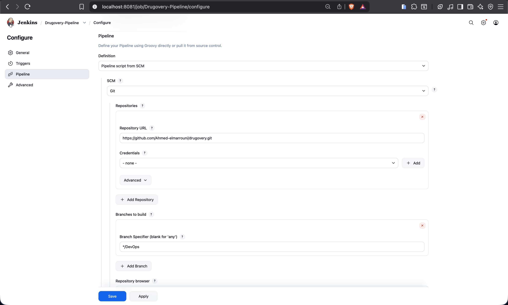

### Step 5: Create the Jenkinsfile

I created a new file named `Jenkinsfile` in the root folder of my project.

Inside this file, I added the pipeline stages to tell Jenkins exactly how to build the Docker containers and test the code automatically.

### Step 6 : Pipeline building

so at first build attempt I faild
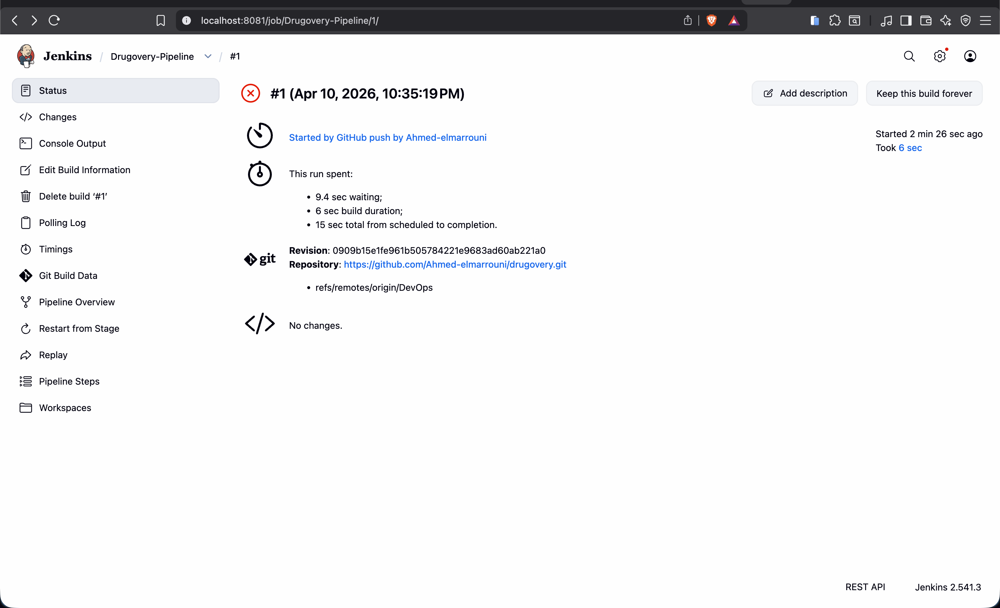

so the issue was my Jenkins pipeline was trying to build my project using Docker Compose, but the official Jenkins container doesn't have the docker command installed inside it by default

so I installed Docker inside my Jenkins container

```bash
docker exec -u root 0c4e9e2d8fef bash -c "apt-get update && apt-get install -y docker.io"
```

and then i make sure the Jenkins user has permission to talk to the Docker socket by run

```bash
docker exec -u root 0c4e9e2d8fef chmod 666 /var/run/docker.sock
```

so It's failed again cuz the 1st command that's I run it's was only for installed the basic Docker engine, but it didn't include the Compose plugin, That is why Jenkins says 'compose' is not a docker command ( I got this from console output at jenkins console)

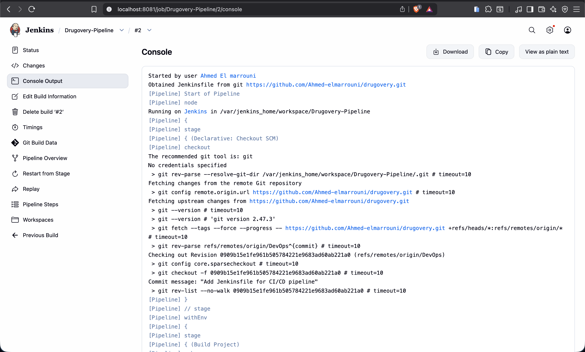

so I run this command to install the missing plugin

```bash
docker exec -u root 0c4e9e2d8fef bash -c "apt-get update && apt-get install -y docker-compose-plugin"
```

even this failed and I got this error : `Unable to locate package docker-compose-plugin`
because the default Debian repositories in my Jenkins container don't include the official Docker plugins

7th attemt : I found that the pipeline failed because Jenkins tried to use my local development settings (volumes and ports). I fixed this by moving my local settings to a `docker-compose.override.yml` file.

This allows me to keep using hot-reload on my Mac while letting Jenkins run a clean, isolated build in the CI environment without any folder or port conflicts.
